# 第十八章 网络协议栈

## 一、概述

现代操作系统离不开网络，**这也是本章要解决的问题**。v0.3 通过 virtio-net 虚拟网卡接入 QEMU 的用户模式网络（slirp），实现一个**精简的 IPv4 协议栈**：以太网帧收发、ARP 地址解析、IP 路由与校验、ICMP ping 应答、UDP socket。

本章分三部分：PCIe 配置空间访问（找设备）、virtio-net 驱动（现代 virtio PCI 布局）、网络协议栈（net/arp/ip/icmp/udp）。本章代码对应最终版本 `src/kernel/pci.c`、`src/kernel/virtio_net.c`、`src/kernel/net/` 目录。

## 二、PCIe 配置空间：找网卡

QEMU virt 机器的 virtio-net 以 PCIe 设备挂载，**驱动它的首要任务**是在 PCI 配置空间里找到它的厂商 ID/设备 ID（virtio-net 是 0x1af4/0x1000）。

### （一） 配置空间地址

v0.3 的 ECAM 基址处理（真源）：

```c
// src/kernel/pci.c
// ARM64 QEMU virt PCIe ECAM 配置空间访问
// QEMU 9.0+ ECAM at 0x4010000000; older at 0x3f000000
#include "pci.h"
#include "uart.h"
#include <stdint.h>

static volatile uint32_t *ecam_base;

static inline volatile uint32_t *pci_config_addr(int bus, int dev, int func, int reg) {
    return (volatile uint32_t *)(
        (uintptr_t)ecam_base
        | ((uintptr_t)bus << 20)
        | ((uintptr_t)dev << 15)
        | ((uintptr_t)func << 12)
        | ((uintptr_t)(reg & 0xFC))
    );
}

uint32_t pci_config_read(int bus, int dev, int func, int reg) {
    return *pci_config_addr(bus, dev, func, reg);
}

void pci_config_write(int bus, int dev, int func, int reg, uint32_t val) {
    *pci_config_addr(bus, dev, func, reg) = val;
}
```

ECAM 编码：配置空间地址 = 基址 | (bus << 20) | (dev << 15) | (func << 12) | (reg & 0xFC)。每个设备 4KB，每个函数 4KB。

**注意 v0.3 的关键更新**：QEMU 10.x 的 virt 机器把 ECAM 放在 **64 位地址 0x4010000000**（而不是老版本文档常见的 0x3f000000）。这就是为什么第 4 章要新增 `uart_puthex64`：32 位的 `uart_puthex` 打印不出 0x4010000000。

### （二） 搜索设备

```c
uint32_t pci_find_device(uint16_t vendor_id, uint16_t device_id) {
    // QEMU virt 9.0+: PCIe ECAM at 0x4010000000
    // QEMU virt <9.0:  PCIe ECAM at 0x3f000000
    uintptr_t bases[] = { 0x4010000000ULL, 0x3f000000ULL };

    for (int b = 0; b < 2; b++) {
        ecam_base = (volatile uint32_t *)bases[b];
        uint32_t id = pci_config_read(0, 0, 0, 0);
        uint16_t vid = id & 0xFFFF;
        if (vid == 0x0000 || vid == 0xFFFF) continue;

        for (int dev = 0; dev < 32; dev++) {
            id = pci_config_read(0, dev, 0, 0);
            vid = id & 0xFFFF;
            uint16_t did = (id >> 16) & 0xFFFF;
            if (vid == 0x0000 || vid == 0xFFFF) continue;
            if (vid == vendor_id && did == device_id) {
                // Enable memory space + bus mastering
                uint32_t cmd = pci_config_read(0, dev, 0, 0x04);
                pci_config_write(0, dev, 0, 0x04, cmd | 0x6);
                // Assign BAR4 (64-bit memory BAR) to 0x10000000
                pci_config_write(0, dev, 0, 0x20, 0x10000000);
                pci_config_write(0, dev, 0, 0x24, 0);
                return 0x10000000;
            }
        }
    }
    return 0;
}
```

初始化要点有三个。双基址探测：先试新基址 0x4010000000，读 bus0 的 ID；无效（0x0000/0xFFFF）再试旧基址 0x3f000000，因为 QEMU 9.0+ 的 ECAM 已迁到 64 位地址，旧版兼容不可或缺。使能命令字：写命令寄存器（0x04）置位 `0x6`（bit1 = Memory Space Enable，bit2 = Bus Master Enable），否则设备不响应内存访问。这是 PCI 驱动最容易漏的一步，漏了所有 BAR 读回 0xffffffff。固定 BAR4 到 0x10000000：virtio modern PCI 的 CommonCfg/Notify/ISR/DeviceCfg 都在 BAR4（64 位 memory BAR）中，写 `0x20`（BAR4 低 32 位）为 0x10000000、`0x24`（高 32 位）为 0——固定地址简化了驱动，不需要枚举空闲内存窗口。

## 三、virtio-net 驱动

### （一） 能力链表：找到各区域偏移

virtio PCI 设备把 4 个寄存器区域（CommonCfg / Notify / ISR / DeviceCfg）的偏移放在 PCI 能力链表里（Vendor capability 0x09），**初始化流程的第一步**是遍历链表，取出 Notify 和 DeviceCfg 的偏移（真源）：

```c
// src/kernel/virtio_net.c
// virtio-net PCI 驱动（QEMU virt, modern virtio PCI layout in BAR4）
#include "virtio_net.h"
#include "pci.h"
#include "uart.h"
#include "string.h"
#include "net.h"

static volatile uint8_t *io_base;
static uint8_t mac_addr[6];
static uint32_t notify_off_multiplier;
static uintptr_t notify_base;
static uintptr_t device_cfg_base;

// vring 布局：desc 表 + avail 环放在同一块 4K 对齐内存，
// used 环单独放一块 4K 对齐内存（VirtIO 规范要求 used ring 页对齐）
static uint8_t rx_queue_mem[VIRTIO_QUEUE_SIZE * 16 + 6 + VIRTIO_QUEUE_SIZE * 2] __attribute__((aligned(4096)));
static uint8_t tx_queue_mem[VIRTIO_QUEUE_SIZE * 16 + 6 + VIRTIO_QUEUE_SIZE * 2] __attribute__((aligned(4096)));
static uint8_t rx_used_mem[VIRTIO_QUEUE_SIZE * 8 + 8] __attribute__((aligned(4096)));
static uint8_t tx_used_mem[VIRTIO_QUEUE_SIZE * 8 + 8] __attribute__((aligned(4096)));

static uint8_t rx_buffers[VIRTIO_QUEUE_SIZE][1526];
static uint8_t tx_buffers[VIRTIO_QUEUE_SIZE][1526];

// CommonCfg register offsets (BAR offset 0)
#define DEVICE_FEATURES_SEL  0x00
#define DEVICE_FEATURES      0x04
#define DRIVER_FEATURES_SEL  0x08
#define DRIVER_FEATURES      0x0C
#define DEVICE_STATUS        0x14
#define QUEUE_SEL            0x16
#define QUEUE_SIZE           0x18
#define QUEUE_ENABLE         0x1C
#define QUEUE_NOTIFY_OFF     0x1E
#define QUEUE_DESC_LO        0x20
#define QUEUE_DESC_HI        0x24
#define QUEUE_DRIVER_LO      0x28
#define QUEUE_DRIVER_HI      0x2C
#define QUEUE_DEVICE_LO      0x30
#define QUEUE_DEVICE_HI      0x34
```

vring 内存布局（v0.3 修复版）：desc 表（`qsize*16`）+ avail ring（`2 + qsize*2`）放同一块 4KB 对齐内存，**used ring 单独一块 4KB 对齐内存**（`rx_used_mem`/`tx_used_mem`）。这是 VirtIO 规范的硬性要求（used ring 必须页对齐），早期版本把三个环挤在一块内存、avail 地址多加 2 字节（误把 flags 也算进偏移），导致设备写 used ring 时越过页边界、RX 轮询永远取不到包。`rx_buffers`/`tx_buffers` 各是 256 个 1526 字节缓冲区（MTU 1500 + 以太网头 + 尾部），`tx_buffers` 用于发送前拷贝（设备 DMA 异步读，调用方缓冲不能提前释放）。

```c
void virtio_net_init(void) {
    uint32_t bar = pci_find_device(0x1af4, 0x1000);
    if (!bar) {
        uart_puts("virtio-net: device not found\n");
        return;
    }
    io_base = (volatile uint8_t *)(uintptr_t)bar;

    // Parse PCI capabilities to find region offsets
    int cap_ptr = pci_config_read(0, 1, 0, 0x34) & 0xFF;
    notify_base = 0x3000;
    device_cfg_base = 0x2000;
    notify_off_multiplier = 4;

    while (cap_ptr) {
        uint32_t w0 = pci_config_read(0, 1, 0, cap_ptr);
        uint8_t cap_id = w0 & 0xFF;
        uint8_t next_ptr = (w0 >> 8) & 0xFF;
        uint8_t cfg_type = (w0 >> 24) & 0xFF;

        if (cap_id == 0x09) {
            uint32_t w2 = pci_config_read(0, 1, 0, cap_ptr + 8);
            if (cfg_type == 2) {  // Notify
                notify_base = w2;
                notify_off_multiplier = pci_config_read(0, 1, 0, cap_ptr + 16);
            } else if (cfg_type == 4) {  // Device config
                device_cfg_base = w2;
            }
        }
        cap_ptr = next_ptr;
    }

    // Read MAC from device config
    for (int i = 0; i < 6; i++)
        mac_addr[i] = read8(device_cfg_base + i);
    ...
```

**v0.3 优化点**：早期版本硬编码 Notify=0x3000/DeviceCfg=0x2000/multiplier=4（QEMU 恰好如此）；v0.3 从 PCI 能力链表动态读取（cfg_type 2 = Notify 的 BAR offset，cfg_type 4 = DeviceCfg 的 BAR offset，Notify 能力头部第 16 字节 = notify_off_multiplier），兼容真实硬件。`mac_addr` 从 DeviceCfg 偏移 0 起读 6 字节。

### （二） 特性协商与队列配置

```c
    // Reset and negotiate features
    write8(DEVICE_STATUS, 0);
    write8(DEVICE_STATUS, 1);                    // ACKNOWLEDGE
    write8(DEVICE_STATUS, 1 | 2);                // DRIVER
    write32(DRIVER_FEATURES_SEL, 0);
    write32(DRIVER_FEATURES, 0);
    write8(DEVICE_STATUS, 1 | 2 | 8);            // FEATURES_OK

    if (!(read8(DEVICE_STATUS) & 8)) {
        uart_puts("virtio-net: features failed\n");
        return;
    }

    // Set up queue 0 (RX) and queue 1 (TX)
    for (int q = 0; q < 2; q++) {
        uint16_t qsize;
        uintptr_t qmem;
        write16(QUEUE_SEL, q);
        if (q == 0) { qsize = read16(QUEUE_SIZE); qmem = (uintptr_t)rx_queue_mem; }
        else        { write16(QUEUE_SEL, 1); qsize = read16(QUEUE_SIZE); qmem = (uintptr_t)tx_queue_mem; }

        uint64_t desc_pa = qmem;
        write32(QUEUE_DESC_LO, (uint32_t)desc_pa);
        write32(QUEUE_DESC_HI, (uint32_t)(desc_pa >> 32));
        uint64_t avail_pa = desc_pa + qsize * 16;
        write32(QUEUE_DRIVER_LO, (uint32_t)avail_pa);
        write32(QUEUE_DRIVER_HI, (uint32_t)(avail_pa >> 32));
        uint64_t used_pa = (uintptr_t)((q == 0) ? rx_used_mem : tx_used_mem);
        write32(QUEUE_DEVICE_LO, (uint32_t)used_pa);
        write32(QUEUE_DEVICE_HI, (uint32_t)(used_pa >> 32));
        write16(QUEUE_ENABLE, 1);
    }

    write8(DEVICE_STATUS, 1 | 2 | 8 | 4);  // DRIVER_OK
```

状态机（现代 virtio）：RESET(0) → ACKNOWLEDGE(1) → DRIVER(2) → FEATURES_OK(8) → DRIVER_OK(4)。特征协商从简（`DRIVER_FEATURES = 0`，不要求任何特性位）。每个队列写 desc/avail/used 三个物理地址（QUEUE_DESC_LO/HI、QUEUE_DRIVER_LO/HI、QUEUE_DEVICE_LO/HI）后置 `QUEUE_ENABLE = 1`。**两个 v0.3 修复点**：循环开头显式 `write16(QUEUE_SEL, q)` 选中要配置的队列（早期版本只在 q==1 分支写 QUEUE_SEL，导致初始化 RX 队列时实际写进了队列 1，这是收包始终为空的最初根因之一）；avail/used 的物理地址按修复后的内存布局计算（avail 不再加 2 字节 flags 偏移）。

### （三） 填充 RX 队列

```c
    // Fill RX queue
    write16(QUEUE_SEL, 0);
    uint16_t qsize = read16(QUEUE_SIZE);
    struct vring_desc *desc = (struct vring_desc *)rx_queue_mem;
    for (int i = 0; i < qsize; i++) {
        // QEMU DMA 写窗口为 [addr+10, addr+len)，补偿使数据落在缓冲区起点
        desc[i].addr = (uint64_t)(uintptr_t)rx_buffers[i] - 10;
        desc[i].len = 1526;
        desc[i].flags = VRING_DESC_F_WRITE;
        desc[i].next = 0;
    }
    struct vring_avail *avail = (struct vring_avail *)(rx_queue_mem + qsize * 16);
    avail->flags = 0;
    avail->idx = qsize;
    for (int i = 0; i < qsize; i++)
        avail->ring[i] = i;

    // Notify queue 0
    uint16_t noff = read16(QUEUE_NOTIFY_OFF);
    write16(notify_base + (uint32_t)noff * notify_off_multiplier, 0);

    uart_puts("virtio-net: initialized, MAC ");
    for (int i = 0; i < 6; i++) {
        if (i) uart_putc(':');
        uart_puthex_byte(mac_addr[i]);
    }
    uart_puts("\n");
}
```

每个 RX 描述符指向一个 1526 字节缓冲区，`VRING_DESC_F_WRITE`（设备可写），全部进 avail ring，`avail->idx = qsize` 表示有 qsize 个可用描述符，最后**通知**队列 0 设备可以开始收包。**注意 `desc[i].addr` 的 `- 10` 补偿**：本书实测的 QEMU（virt 机型，virtio-net-pci）DMA 读写窗口比描述符声明的 `[addr, addr+len)` 整体右移 10 字节，即设备实际读 `[addr+10, addr+len)`、写 `[addr+10, addr+len)`，且不附带任何 virtio_net_hdr。这个怪癖是本机的真实行为，改参数或换 QEMU 版本时需要用 filter-dump 抓包重新确认。

| 方向 | 描述符 addr | 描述符 len | 设备实际窗口 | 效果 |
|---|---|---|---|---|
| RX | `rx_buffers[i] - 10` | 1526 | `[rx_buffers[i], +1526)` | 数据落在缓冲区起点 |
| TX | `tx_buffers[idx] - 10` | `len + 10` | `[tx_buffers[idx], +len)` | 整帧被设备完整读走 |

同一偏移在收发两个方向各补偿一次：RX 让设备写窗口左移回缓冲区起点，TX 让设备读窗口覆盖完整帧（len 也加 10，保证窗口右端够长）。

### （四） 发送与接收

```c
uint8_t *virtio_net_get_mac(void) {
    return mac_addr;
}

int virtio_net_send(const uint8_t *data, size_t len) {
    static uint16_t tx_idx = 0;
    uint16_t qsize = VIRTIO_QUEUE_SIZE;
    struct vring_desc *desc = (struct vring_desc *)tx_queue_mem;
    uint16_t idx = tx_idx % qsize;
    // 拷贝到静态缓冲：设备 DMA 读期间数据必须保持有效
    for (size_t i = 0; i < len; i++) tx_buffers[idx][i] = data[i];
    // QEMU DMA 读窗口为 [addr+10, addr+len)，用 addr-10 / len+10 补偿
    desc[idx].addr = (uint64_t)(uintptr_t)tx_buffers[idx] - 10;
    desc[idx].len = (uint32_t)len + 10;
    desc[idx].flags = 0;
    desc[idx].next = 0;

    struct vring_avail *avail = (struct vring_avail *)(tx_queue_mem + qsize * 16);
    avail->ring[tx_idx % qsize] = idx;
    avail->idx = tx_idx + 1;
    tx_idx++;

    write16(QUEUE_SEL, 1);
    uint16_t noff = read16(QUEUE_NOTIFY_OFF);
    write16(notify_base + (uint32_t)noff * notify_off_multiplier, 1);

    // 同步等待设备完成发送（DMA 读完数据缓冲区后才可被调用方释放）
    struct vring_used *tx_used = (struct vring_used *)tx_used_mem;
    while (tx_used->idx != (uint16_t)tx_idx) ;

    return len;
}

// 轮询 RX 队列：把收到的包交给协议栈（非阻塞，无数据时立即返回）
void virtio_net_poll(void) {
    uint16_t qsize = VIRTIO_QUEUE_SIZE;
    struct vring_used *used = (struct vring_used *)rx_used_mem;
    struct vring_avail *avail = (struct vring_avail *)(rx_queue_mem + qsize * 16);
    static uint16_t last_used = 0;

    while (last_used != used->idx) {
        uint16_t u = last_used % qsize;
        uint32_t id = used->ring[u].id;
        uint32_t len = used->ring[u].len;
        last_used++;

        uint8_t *pkt = rx_buffers[id];
        net_rx_handler(pkt, len);

        // 把缓冲区归还 RX 队列
        uint16_t a = avail->idx;
        avail->ring[a % qsize] = id;
        avail->idx = a + 1;
        write16(QUEUE_SEL, 0);
        uint16_t noff = read16(QUEUE_NOTIFY_OFF);
        write16(notify_base + (uint32_t)noff * notify_off_multiplier, 0);
    }
}
```

发送路径的三个 v0.3 修复：**① 静态缓冲拷贝**：设备 DMA 是异步的，它按自己的节奏读发送缓冲区，调用方 `ip_send` 发完就 `kfree`，早期版本抓包看到 pcap 里是内核堆字节（数据被覆盖）；先拷进 `tx_buffers[idx]` 再交给设备。**② DMA 偏移补偿**：与 RX 相同的 `addr-10 / len+10`。**③ 同步等待**：`virtio_net_send` 返回前轮询 `tx_used->idx`，确认设备已把数据读走，调用方才安全释放。**`virtio_net_poll` 替代了原来的 `virtio_net_recv` stub**：不依赖中断，每次调用把设备已完成的 RX 描述符逐个取回、交给 `net_rx_handler` 投递进协议栈，再把缓冲区归还 avail ring。中断驱动的收包（GIC + MSI-X）留给练习。

从"初始化成功但收不到包"到真实收发，v0.3 一共修了五类问题，每个都对应一次抓包或日志排查：

| 现象 | 根因 | 修复 |
|---|---|---|
| RX 轮询永远取不到包 | 初始化 RX 队列前没有先写 `QUEUE_SEL=0`，配置写进了队列 1 | 队列配置循环开头显式 `write16(QUEUE_SEL, q)` |
| used ring 内容异常 | desc/avail/used 三环挤在一块内存，avail 地址多加 2 字节，used 未页对齐 | used ring 独立 4KB 对齐内存，avail 偏移修正 |
| pcap 里是内核堆字节 | 设备 DMA 异步读发送缓冲，调用方 `kfree` 提前释放 | `tx_buffers` 静态拷贝 + 发送后同步等待 `tx_used->idx` |
| ARP spa/tpa 错位（0.0.10.0 之类） | `struct arphdr` 未打包，AArch64 对齐插入填充字节 | `__attribute__((packed))` |
| 帧内 IP 字段全乱 | 大端常量直接赋值，未转网络字节序 | 收发共 5 处 `__builtin_bswap32` |

一个包从线缆到用户程序，依次经过五道处理：

| 环节 | 函数 | 作用 |
|---|---|---|
| 轮询收包 | `virtio_net_poll` | 取 used ring 完成项，归还 avail ring |
| 收包分发 | `net_rx_handler` | 按以太网类型分发 ARP / IP |
| 传输层投递 | `udp_rx` | 按目的端口找 socket，数据入缓冲 |
| 系统调用收数 | `sys_net_recv` | 先 poll 再 `udp_recvfrom` 读出 |
| 用户解析 | `net.c` | 跳过 DNS 头/问题段，读答案记录 |

## 四、网络协议栈

### （一） 初始化与收包分发

```c
// src/kernel/net/net.c
#include "net.h"
#include "virtio_net.h"
#include "uart.h"

extern void arp_init(void);
extern void arp_rx(struct arphdr *arp);
extern void ip_init(void);
extern void ip_rx(struct iphdr *ip, size_t total_len);
extern void icmp_init(void);
extern void udp_init(void);

void net_init(void) {
    virtio_net_init();
    arp_init();
    ip_init();
    icmp_init();
    udp_init();
    uart_puts("net: protocol stack initialized\n");
}

// 网络接收处理入口
void net_rx_handler(uint8_t *data, size_t len) {
    if (len < sizeof(struct ethhdr)) {
        return;
    }

    struct ethhdr *eth = (struct ethhdr *)data;
    uint16_t proto = __builtin_bswap16(eth->h_proto);

    switch (proto) {
        case ETH_TYPE_ARP:
            arp_rx((struct arphdr *)(data + sizeof(struct ethhdr)));
            break;
        case ETH_TYPE_IPV4:
            ip_rx((struct iphdr *)(data + sizeof(struct ethhdr)),
                  len - sizeof(struct ethhdr));
            break;
        default:
            // 不支持的协议，忽略
            break;
    }
}
```

网络配置（include/net.h，真源）：

```c
// 网络配置（QEMU 用户模式网络）
#define NET_IP_ADDR      0x0A00020F  // 10.0.2.15
#define NET_NETMASK      0xFFFFFF00  // 255.255.255.0
#define NET_GATEWAY      0x0A000202  // 10.0.2.2
#define NET_DNS          0x0A000203  // 10.0.2.3

// 以太网帧类型
#define ETH_TYPE_IPV4    0x0800
#define ETH_TYPE_ARP     0x0806
```

QEMU slirp 默认给 guest 的地址是 10.0.2.15，网关 10.0.2.2，DNS 10.0.2.3。注意这些都是**大端存储**的常量（0x0A00020F 内存中显示为 0A 00 02 0F）。

| 项 | 值 | 宏 | 说明 |
|---|---|---|---|
| guest IP | 10.0.2.15 | `NET_IP_ADDR` | 本机地址 |
| 子网掩码 | 255.255.255.0 | `NET_NETMASK` | 同子网判定 |
| 网关 | 10.0.2.2 | `NET_GATEWAY` | 跨子网下一跳 |
| DNS | 10.0.2.3 | `NET_DNS` | slirp 内置 DNS |
| guest MAC | 52:54:00:12:34:56 | 读自 DeviceCfg | QEMU 默认 MAC |

### （二） ARP：地址解析

```c
// src/kernel/net/arp.c
#include "net.h"
#include "virtio_net.h"
#include "uart.h"
#include "string.h"

#define ARP_CACHE_SIZE 16

struct arp_entry {
    uint32_t ip;
    uint8_t  mac[ETH_ALEN];
    int      valid;
};

static struct arp_entry arp_cache[ARP_CACHE_SIZE];

void arp_init(void) {
    for (int i = 0; i < ARP_CACHE_SIZE; i++) {
        arp_cache[i].valid = 0;
    }
}

static struct arp_entry *arp_find(uint32_t ip) {
    for (int i = 0; i < ARP_CACHE_SIZE; i++) {
        if (arp_cache[i].valid && arp_cache[i].ip == ip) {
            return &arp_cache[i];
        }
    }
    return NULL;
}

static void arp_add(uint32_t ip, const uint8_t *mac) {
    struct arp_entry *entry = arp_find(ip);
    if (!entry) {
        // 找一个空槽位
        for (int i = 0; i < ARP_CACHE_SIZE; i++) {
            if (!arp_cache[i].valid) {
                entry = &arp_cache[i];
                break;
            }
        }
        if (!entry) entry = &arp_cache[0];  // 满了就覆盖第一个
    }
    entry->ip = ip;
    memcpy(entry->mac, mac, ETH_ALEN);
    entry->valid = 1;
}
```

ARP 缓存是 16 项静态数组，`valid` 标志区分空槽。`arphdr` 在 include/net.h 中定义，且**必须 `packed`**：AArch64 的默认结构对齐会把 `uint32_t` 成员按 4 字节对齐，在 `ar_sha[6]` 之后插入 2 字节填充，导致报文错位（抓包显示 spa=0.0.10.0 之类）。网络报文是字节流，所有头结构都应紧凑打包（真源）：

```c
// 注意：必须紧凑布局，报文不允许有填充字节
struct __attribute__((packed)) arphdr {
    uint16_t ar_hrd;    // 硬件类型
    uint16_t ar_pro;    // 协议类型
    uint8_t  ar_hln;    // 硬件地址长度
    uint8_t  ar_pln;    // 协议地址长度
    uint16_t ar_op;     // 操作码
    uint8_t  ar_sha[ETH_ALEN];  // 发送端 MAC
    uint32_t ar_sip;             // 发送端 IP
    uint8_t  ar_tha[ETH_ALEN];  // 目标端 MAC
    uint32_t ar_tip;             // 目标端 IP
};
```

发送 ARP 请求：

```c
// 发送 ARP 请求
static void arp_send_request(uint32_t target_ip) {
    uint8_t frame[sizeof(struct ethhdr) + sizeof(struct arphdr)];
    struct ethhdr *eth = (struct ethhdr *)frame;
    struct arphdr *arp = (struct arphdr *)(frame + sizeof(struct ethhdr));

    uint8_t *mac = virtio_net_get_mac();

    // 以太网头部：广播
    memset(eth->h_dest, 0xFF, ETH_ALEN);
    memcpy(eth->h_source, mac, ETH_ALEN);
    eth->h_proto = __builtin_bswap16(ETH_TYPE_ARP);

    // ARP 请求
    arp->ar_hrd = __builtin_bswap16(1);          // 以太网
    arp->ar_pro = __builtin_bswap16(ETH_TYPE_IPV4);
    arp->ar_hln = ETH_ALEN;
    arp->ar_pln = IP_ALEN;
    arp->ar_op  = __builtin_bswap16(ARP_OP_REQUEST);
    memcpy(arp->ar_sha, mac, ETH_ALEN);
    arp->ar_sip = __builtin_bswap32(NET_IP_ADDR);
    memset(arp->ar_tha, 0, ETH_ALEN);
    arp->ar_tip = __builtin_bswap32(target_ip);

    virtio_net_send(frame, sizeof(frame));
}
```

收包处理（请求 → 应答）：

```c
// 处理收到的 ARP 包
void arp_rx(struct arphdr *arp) {
    uint16_t op = __builtin_bswap16(arp->ar_op);

    // 不管是请求还是响应，都把发送端的 IP-MAC 加入缓存
    arp_add(__builtin_bswap32(arp->ar_sip), arp->ar_sha);

    if (op == ARP_OP_REQUEST && __builtin_bswap32(arp->ar_tip) == NET_IP_ADDR) {
        // 这是发给我们的 ARP 请求，发送 ARP 响应
        uint8_t frame[sizeof(struct ethhdr) + sizeof(struct arphdr)];
        struct ethhdr *eth = (struct ethhdr *)frame;
        struct arphdr *reply = (struct arphdr *)(frame + sizeof(struct ethhdr));
        uint8_t *mac = virtio_net_get_mac();

        memcpy(eth->h_dest, arp->ar_sha, ETH_ALEN);
        memcpy(eth->h_source, mac, ETH_ALEN);
        eth->h_proto = __builtin_bswap16(ETH_TYPE_ARP);

        reply->ar_hrd = __builtin_bswap16(1);
        reply->ar_pro = __builtin_bswap16(ETH_TYPE_IPV4);
        reply->ar_hln = ETH_ALEN;
        reply->ar_pln = IP_ALEN;
        reply->ar_op  = __builtin_bswap16(ARP_OP_REPLY);
        memcpy(reply->ar_sha, mac, ETH_ALEN);
        reply->ar_sip = __builtin_bswap32(NET_IP_ADDR);
        memcpy(reply->ar_tha, arp->ar_sha, ETH_ALEN);
        reply->ar_tip = arp->ar_sip;

        virtio_net_send(frame, sizeof(frame));
    }
}

// 解析 IP 地址为 MAC 地址，未命中时发送 ARP 请求并返回 0
uint32_t resolve_arp(uint32_t ip) {
    struct arp_entry *entry = arp_find(ip);
    if (entry) {
        return (uint32_t)(uintptr_t)entry->mac;  // 返回 MAC 地址指针
    }
    arp_send_request(ip);
    return 0;  // 未命中，需要等待 ARP 响应
}
```

**v0.3 的设计**：`resolve_arp` 命中时直接返回 MAC 数组的**指针**（类型上截断成 uint32_t 传出去），`ip_send` 再当指针用（第 4 章编译警告 `cast to pointer from integer of different size` 的来源）。未命中时发请求并返回 0，**等待响应由 `ip_send` 的轮询循环完成**（见下一节）。所有 IP 字段用 `__builtin_bswap32` 转成网络字节序写报文，收包时再转回主机序比较/缓存（v0.3 修复：早期版本直接赋值大端常量，spa/tpa 全错）。

### （三） IP：路由与校验

```c
// src/kernel/net/ip.c
#include "net.h"
#include "virtio_net.h"
#include "uart.h"
#include "string.h"
#include "slab.h"

extern void icmp_rx(struct iphdr *ip, uint8_t *data, size_t len);
extern void udp_rx(struct iphdr *ip, uint8_t *data, size_t len);

static uint16_t ip_id_counter = 0;

void ip_init(void) {
    ip_id_counter = 0;
}

// 处理收到的 IP 包
void ip_rx(struct iphdr *ip, size_t total_len) {
    // 验证版本和 IHL
    uint8_t version = ip->ihl_version >> 4;
    uint8_t ihl = ip->ihl_version & 0x0F;
    if (version != 4 || ihl < 5) {
        return;  // 不是 IPv4 或头部太短
    }

    size_t header_len = ihl * 4;
    if (total_len < header_len) {
        return;
    }

    // 验证校验和
    uint16_t old_check = ip->check;
    ip->check = 0;
    uint16_t calc_check = ip_checksum(ip, header_len);
    ip->check = old_check;
    if (old_check != calc_check) {
        uart_puts("ip: checksum mismatch\n");
        return;
    }

    // 检查目的 IP 是否是我们的地址或广播
    uint32_t daddr = __builtin_bswap32(ip->daddr);
    if (daddr != NET_IP_ADDR && daddr != 0xFFFFFFFF) {
        return;  // 不是发给我们的
    }

    uint8_t *payload = (uint8_t *)ip + header_len;
    size_t payload_len = __builtin_bswap16(ip->tot_len) - header_len;

    // 根据协议分发
    switch (ip->protocol) {
        case IP_PROTO_ICMP:
            icmp_rx(ip, payload, payload_len);
            break;
        case IP_PROTO_UDP:
            udp_rx(ip, payload, payload_len);
            break;
        default:
            // 不支持的协议，忽略
            break;
    }
}
```

收包检查链：版本/IHL → 头部长度 → **校验和**（验证后恢复原值）→ 目的地址（自己或广播）→ 按协议号分发。发送路径：

```c
// 发送 IP 包
int ip_send(uint32_t dst_ip, uint8_t protocol, const uint8_t *data, size_t len) {
    size_t total_len = sizeof(struct iphdr) + len;
    uint8_t *packet = kmalloc(total_len);  // 假设已有 kmalloc
    if (!packet) return -1;

    struct iphdr *ip = (struct iphdr *)packet;
    ip->ihl_version = (4 << 4) | 5;  // IPv4, IHL=5
    ip->tos = 0;
    ip->tot_len = __builtin_bswap16(total_len);
    ip->id = __builtin_bswap16(ip_id_counter++);
    ip->frag_off = 0;  // 不分片
    ip->ttl = 64;
    ip->protocol = protocol;
    ip->check = 0;
    ip->saddr = __builtin_bswap32(NET_IP_ADDR);
    ip->daddr = __builtin_bswap32(dst_ip);
    ip->check = ip_checksum(ip, sizeof(struct iphdr));

    memcpy(packet + sizeof(struct iphdr), data, len);

    // 确定下一跳：同一子网直接发送，否则发送到网关
    uint32_t next_hop;
    if ((dst_ip & NET_NETMASK) == (NET_IP_ADDR & NET_NETMASK)) {
        next_hop = dst_ip;
    } else {
        next_hop = NET_GATEWAY;
    }

    // 通过 ARP 获取下一跳的 MAC 地址：
    // 未命中时发送 ARP 请求，轮询 RX 队列等待响应（最多约 2 秒）
    uint8_t *mac = NULL;
    for (int attempt = 0; attempt < 40 && !mac; attempt++) {
        mac = (uint8_t *)resolve_arp(next_hop);
        if (mac) break;
        virtio_net_poll();                    // 处理收到的 ARP 响应
        for (volatile int i = 0; i < 50000; i++);  // 短暂延迟
    }
    if (!mac) {
        kfree(packet);  // ARP 未命中，丢弃
        return -1;
    }

    // 封装以太网帧并发送
    size_t frame_len = sizeof(struct ethhdr) + total_len;
    uint8_t *frame = kmalloc(frame_len);
    if (!frame) {
        kfree(packet);
        return -1;
    }

    struct ethhdr *eth = (struct ethhdr *)frame;
    memcpy(eth->h_dest, mac, ETH_ALEN);
    memcpy(eth->h_source, virtio_net_get_mac(), ETH_ALEN);
    eth->h_proto = __builtin_bswap16(ETH_TYPE_IPV4);
    memcpy(frame + sizeof(struct ethhdr), packet, total_len);

    virtio_net_send(frame, frame_len);

    kfree(packet);
    kfree(frame);
    return len;
}
```

**路由决策**：目的 IP 与本地 IP 同子网（`NET_NETMASK` 相与）→ 直接发送；否则下一跳 = 网关 10.0.2.2。用 `kmalloc` 动态分配包缓冲（第 9 章）。**ARP 等待循环**是 v0.3 让"发得出包"的关键：首次发往 10.0.2.3（跨子网 → 网关 10.0.2.2）时 ARP 缓存必然未命中，`resolve_arp` 发请求后返回 0，`ip_send` 不立即放弃，而是循环调用 `virtio_net_poll()` 收 ARP 响应 + 空转延迟（40 次 × 50000 空转，约 2 秒），命中后继续封装发送。没有这个循环，`udp_sendto` 永远返回 -1（早期调试日志里的 `send failed` 即由此而来）。

### （四） ICMP：ping 应答

```c
// src/kernel/net/icmp.c
#include "net.h"
#include "uart.h"
#include "string.h"

extern int ip_send(uint32_t dst_ip, uint8_t protocol, const uint8_t *data, size_t len);

void icmp_init(void) {
    // 无需初始化
}

// 处理收到的 ICMP 包
void icmp_rx(struct iphdr *ip, uint8_t *data, size_t len) {
    if (len < sizeof(struct icmphdr)) {
        return;
    }

    struct icmphdr *icmp = (struct icmphdr *)data;

    if (icmp->type == ICMP_TYPE_ECHO_REQUEST) {
        // 收到 ping 请求，回复 ping 响应
        uint32_t src_ip = __builtin_bswap32(ip->saddr);

        uart_puts("icmp: echo request from ");
        uart_puthex((src_ip >> 24) & 0xFF);
        uart_putc('.');
        uart_puthex((src_ip >> 16) & 0xFF);
        uart_putc('.');
        uart_puthex((src_ip >> 8) & 0xFF);
        uart_putc('.');
        uart_puthex(src_ip & 0xFF);
        uart_puts("\n");

        // 构造 Echo Reply：类型改为 0，校验和重新计算
        icmp->type = ICMP_TYPE_ECHO_REPLY;
        icmp->checksum = 0;
        icmp->checksum = ip_checksum(icmp, len);

        // 交换源和目的 IP 发送
        ip_send(src_ip, IP_PROTO_ICMP, data, len);
    }
}
```

**icmp_rx 的处理流程**：收到 ping 请求 → 打印源 IP（十进制四段）→ 类型改为 0（Reply）→ 重算校验和 → `ip_send` 回给源。**改的是原缓冲**（`data` 指向 ip_rx 传入的 payload），减少拷贝。

### （五） UDP：socket 模型

```c
// src/kernel/net/udp.c
#include "udp.h"
#include "uart.h"
#include "string.h"
#include "slab.h"

extern int ip_send(uint32_t dst_ip, uint8_t protocol, const uint8_t *data, size_t len);

static struct udp_socket sockets[UDP_MAX_SOCKETS];

void udp_init(void) {
    for (int i = 0; i < UDP_MAX_SOCKETS; i++) {
        sockets[i].used = 0;
        sockets[i].rx_len = 0;
    }
}

// 处理收到的 UDP 包
void udp_rx(struct iphdr *ip, uint8_t *data, size_t len) {
    if (len < sizeof(struct udphdr)) {
        return;
    }

    struct udphdr *udp = (struct udphdr *)data;
    uint16_t dst_port = __builtin_bswap16(udp->dest);
    uint16_t src_port = __builtin_bswap16(udp->source);
    uint32_t src_ip = __builtin_bswap32(ip->saddr);

    // 查找绑定到该端口的 socket
    for (int i = 0; i < UDP_MAX_SOCKETS; i++) {
        if (sockets[i].used && sockets[i].local_port == dst_port) {
            // 把数据放入接收缓冲区
            uint8_t *payload = data + sizeof(struct udphdr);
            size_t payload_len = len - sizeof(struct udphdr);
            if (payload_len > UDP_RX_BUF_SIZE) {
                payload_len = UDP_RX_BUF_SIZE;
            }
            memcpy(sockets[i].rx_buf, payload, payload_len);
            sockets[i].rx_len = payload_len;
            sockets[i].remote_ip = src_ip;
            sockets[i].remote_port = src_port;
            return;
        }
    }
    // 没有找到对应的 socket，丢弃数据包
}
```

收包按目的端口找绑定的 socket，数据拷入其接收缓冲。发送/绑定：

```c
int udp_socket(void) {
    for (int i = 0; i < UDP_MAX_SOCKETS; i++) {
        if (!sockets[i].used) {
            sockets[i].used = 1;
            sockets[i].local_port = 0;
            sockets[i].rx_len = 0;
            return i;
        }
    }
    return -1;
}

int udp_bind(int sockfd, uint16_t port) {
    if (sockfd < 0 || sockfd >= UDP_MAX_SOCKETS || !sockets[sockfd].used) {
        return -1;
    }
    sockets[sockfd].local_port = port;
    return 0;
}

int udp_sendto(int sockfd, const uint8_t *data, size_t len,
               uint32_t dst_ip, uint16_t dst_port) {
    if (sockfd < 0 || sockfd >= UDP_MAX_SOCKETS || !sockets[sockfd].used) {
        return -1;
    }

    size_t total_len = sizeof(struct udphdr) + len;
    uint8_t *packet = kmalloc(total_len);
    if (!packet) return -1;

    struct udphdr *udp = (struct udphdr *)packet;
    udp->source = __builtin_bswap16(sockets[sockfd].local_port);
    udp->dest = __builtin_bswap16(dst_port);
    udp->len = __builtin_bswap16(total_len);
    udp->check = 0;  // IPv4 中 UDP 校验和可选，设为 0 表示不校验

    memcpy(packet + sizeof(struct udphdr), data, len);

    int ret = ip_send(dst_ip, IP_PROTO_UDP, packet, total_len);
    kfree(packet);
    return ret > 0 ? len : -1;
}

int udp_recvfrom(int sockfd, uint8_t *buf, size_t max_len,
                 uint32_t *src_ip, uint16_t *src_port) {
    if (sockfd < 0 || sockfd >= UDP_MAX_SOCKETS || !sockets[sockfd].used) {
        return -1;
    }

    if (sockets[sockfd].rx_len == 0) {
        return 0;  // 没有数据
    }

    size_t len = sockets[sockfd].rx_len;
    if (len > max_len) len = max_len;
    memcpy(buf, sockets[sockfd].rx_buf, len);

    if (src_ip) *src_ip = sockets[sockfd].remote_ip;
    if (src_port) *src_port = sockets[sockfd].remote_port;

    sockets[sockfd].rx_len = 0;  // 清空缓冲区
    return len;
}
```

**UDP 校验和置 0**（IPv4 UDP 校验和可选），这是本实现的简化策略。整个 API 与 POSIX 的 socket/bind/sendto/recvfrom 一一对应，是将来实现 TCP 的基础骨架。

三个网络系统调用把这张 UDP API 表开放给用户程序（第 12 章），对应关系如下：

| 系统调用 | 内核处理器 | 内核 UDP API | 用户封装 |
|---|---|---|---|
| `net_socket(port)` | `sys_net_socket` | `udp_socket` + `udp_bind` | `sys_net_socket` |
| `net_send(sockfd, data, len, dst_ip, dst_port)` | `sys_net_send` | `udp_sendto` | `sys_net_send`（走 `_syscall5`） |
| `net_recv(sockfd, buf, max_len, src_ip, src_port)` | `sys_net_recv` | `virtio_net_poll` + `udp_recvfrom` | `sys_net_recv`（走 `_syscall5`） |

### （六） 校验和

```c
// src/kernel/net/checksum.c
#include "net.h"

uint16_t ip_checksum(const void *data, size_t len) {
    const uint16_t *ptr = (const uint16_t *)data;
    uint32_t sum = 0;

    while (len > 1) {
        sum += *ptr++;
        len -= 2;
    }
    if (len == 1) {
        sum += *(const uint8_t *)ptr;
    }

    // 回卷
    while (sum >> 16) {
        sum = (sum & 0xFFFF) + (sum >> 16);
    }

    return (uint16_t)(~sum);
}
```

RFC 1071 校验和：16 位累加 → 回卷（高 16 位加到低 16 位直到无进位）→ 取反。

## 五、Makefile 运行参数

```makefile
run: $(TARGET)
	qemu-system-aarch64 -M virt -m 256M -nographic -cpu cortex-a57 \
		-netdev user,id=net0 \
		-device virtio-net-pci,netdev=net0 \
		-kernel $(TARGET)
```

`-netdev user,id=net0` 创建 slirp 用户网络，`-device virtio-net-pci,netdev=net0` 挂 virtio-net 网卡。guest 地址 10.0.2.15，host 侧 10.0.2.2 提供 NAT。

从 host 侧验证：QEMU 自带用户网络栈，用 host 的 `ping` 不可达 guest（slirp 不支持 inbound ICMP）。更实用的验证是启动日志里出现 `virtio-net: initialized, MAC 52:54:00:12:34:56` 与 `net: protocol stack initialized`。

**从 guest 侧做真实端到端验证**（v0.3 新增）：内核内嵌了 `net` 用户程序（第 12 章），在 shell 里 `run net` 会向 QEMU 用户网络内置的 DNS（10.0.2.3:53）查询 example.com 的 A 记录：

```text
$ run net
[net] UDP DNS query demo (10.0.2.3:53)
[net] querying example.com -> 29 bytes sent
[net] example.com = 104.20.23.154
[net] done
```

这一条输出走完整条链路：ARP 请求（广播）→ slirp 应答 → `virtio_net_poll` 收包入 ARP 缓存 → UDP 报文（IP 校验和、UDP 校验和置 0）→ 设备 TX（静态缓冲 + DMA 补偿 + 同步等待）→ slirp 转发给宿主 DNS → 响应逆路返回 → `net_recv` 取回 → 解析 A 记录打印。**解析出的 104.20.23.154 / 172.66.147.243 是 example.com 在 Cloudflare 的真实地址，多次运行结果不同正是 DNS 轮询**。调试排障时，QEMU 加 `-object filter-dump,id=fd0,netdev=net0,file=/tmp/net.pcap` 可抓 pcap 逐帧确认收发。

`run net` 的完整收发路径（每跳都对应前文的真实代码）：

```mermaid
flowchart LR
    A["shell: run net"] --> B["sys_net_send → udp_sendto"]
    B --> C["ip_send: ARP 请求（广播）"]
    C --> D["virtio_net_send（TX 补偿）"]
    D --> E["QEMU slirp: ARP 应答"]
    E --> F["virtio_net_poll → arp 缓存命中"]
    F --> G["ip_send: UDP 报文 → TX"]
    G --> H["slirp → 宿主 DNS（10.0.2.3:53）"]
    H --> I["DNS 应答 → RX → udp_rx → socket 缓冲"]
    I --> J["sys_net_recv → 解析 A 记录 → 打印 IP"]
```




## 六、小结

本章实现的体系把网络栈从硬件到应用完整串起：PCIe ECAM 配置空间访问（新/旧双基址探测）；virtio-net 现代 PCI 驱动（能力链表、状态机、双队列、vring 布局修复、RX 填充 + 轮询收包）；以太网/ARP/IP/ICMP/UDP 五层协议栈；ARP 缓存（16 项）+ 子网/网关路由 + ARP 等待循环 + IP 校验和；UDP socket 模型（socket/bind/sendto/recvfrom）；以及第 12 章的三个网络系统调用把 UDP 栈开放给用户程序，`run net` 在 QEMU 里真实解析出 example.com 的 IP。**v0.3 相比早期版本真正打通了"收"**：早期 RX 是 stub，只有发送链路（**目前**的收包仍是轮询式，中断驱动尚未实现）；vring 布局（used ring 独立页对齐）、QUEUE_SEL 初始化顺序、DMA 偏移补偿（±10）、`arphdr` packed、ARP 字节序五处修复后，`virtio_net_poll` 能稳定收到 ARP 应答与 UDP 响应。其中"无 MMU 下的物理地址直接访问""virtio 现代 PCI 与 MMIO 的统一""QEMU DMA 窗口偏移这种真实硬件怪癖要靠抓包确认"三个洞察，是本章最值得回味的工程决策。

## 七、练习

练习一，v0.3 用轮询实现了收包（`virtio_net_poll`），把它升级为**中断驱动**：配置 GIC 使能 virtio-net 的 MSI-X/INTx 中断，在中断处理里调用 `virtio_net_poll`，再把 `sys_net_recv` 里的主动 poll 去掉，对比两种方式下 CPU 占用与响应延迟，理解轮询 vs 中断的经典权衡。练习二，在 shell 加 `ping <ip>` 命令，构造 ICMP Echo Request 并打印响应，目标 IP 选网关 10.0.2.2 可测（QEMU slirp 对 inbound ICMP 不响应，选 host 网络下的对端效果更佳）。练习三，给 ARP 加状态机：`resolve_arp` 未命中时挂起发送队列，ARP 响应到达后补发，把"同步阻塞的 ARP"升级为"异步等待的 ARP"，这是理解真实协议栈异步模型的好练习。练习四，扩展 `run net` 支持任意域名（`run net baidu.com`），并让 `net.c` 打印应答的 TTL 与权威服务器（ANCOUNT > 1 时遍历答案段），把第 12 章的手写 DNS 解析器补全到能处理 CNAME 与多答案，就具备了真实解析器的雏形。**建议**按"构造报文 → filter-dump 抓包对照 → 解析应答"三步完成，可以先用 `example.com` 固定报文验证解析器，再参数化域名。
